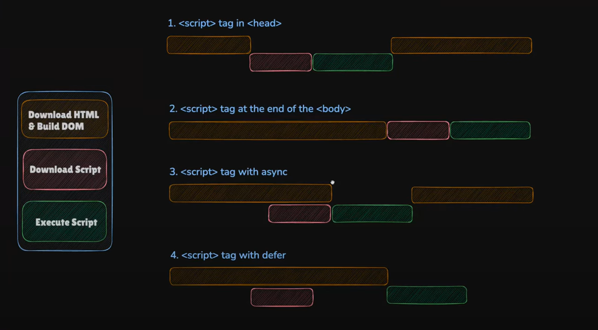

# 🧠 JavaScript Evolution & Script Loading Behavior

## 📜 JavaScript Timeline (1995 - 2025)

✅ **1995** – Brendan Eich creates JavaScript in 10 days at Netscape.  
✅ **1996** – Microsoft releases JScript for Internet Explorer.  
✅ **1997** – ECMAScript (ES1) is standardized.  
✅ **1999** – ES3 introduces Regex & exception handling.  
✅ **2005** – AJAX revolutionizes web interactivity.  
✅ **2006** – jQuery simplifies JavaScript.  
✅ **2009** – ES5 brings JSON support, map(), filter(), reduce().  
✅ **2010** – AngularJS popularizes front-end frameworks.  
✅ **2013** – React.js changes UI development widely.  
✅ **2014** – ECMAScript updates become annual.  
✅ **2015** – ES6 (ECMAScript 2015) introduces let, const, classes, modules, and arrow functions.  
✅ **2016** – Vue.js gains popularity as an alternative to React.  
✅ **2017** – ES8 adds async/await, making asynchronous coding easier.  
✅ **2019** – ES10 introduces optional catch binding and flatMap().  
✅ **2020** – Deno (by Ryan Dahl) challenges Node.js with better security.  
✅ **2021** – ES12 adds logical assignment operators (&&=, ||=, ??=).  
✅ **2022** – ES13 introduces at() for arrays and top-level await.  
✅ **2023** – ES14 brings Array grouping (groupBy()).  
✅ **2024** – React Server Components (RSC) revolutionize web app performance.  
✅ **2025** – JavaScript continues evolving, integrating more AI-driven features & WebAssembly advancements.

---

## ⚙️ Script Loading Behavior in HTML

### 🖼️ Reference Diagram

## 🧩 Explanation of Each Case

### 1️⃣ `<script>` tag in `<head>`

The browser stops parsing HTML as soon as it finds the script.  
It downloads and executes the script immediately, before continuing to build the DOM.

❌ This can delay page rendering because the script blocks HTML parsing.  
✅ Use only for critical scripts needed before page load (e.g., feature detection).

---

### 2️⃣ `<script>` tag at the end of `<body>`

The browser first loads and builds the entire DOM.  
Then it downloads and executes the script after the page is ready.

✅ No blocking — the page loads faster, and scripts can safely access all DOM elements.  
💡 This was the traditional best practice before async and defer.

---

### 3️⃣ `<script async>`

The script downloads in parallel while HTML is still being parsed.  
As soon as the script finishes downloading, HTML parsing pauses, and the script executes immediately.

⚠️ Scripts may run out of order (not sequential).  
✅ Great for independent scripts like ads, analytics, or tracking — that don’t depend on the DOM or other scripts.

---

### 4️⃣ `<script defer>`

The script downloads in parallel while the HTML continues parsing.  
Execution happens after the DOM is fully built, and scripts run in order of appearance.

✅ Best for scripts that depend on the complete DOM structure.  
💡 Commonly used for main JS files at the top of the page.

---

### 📚 Summary Table

| Script Placement / Type | HTML Parsing | Script Download | Script Execution | Notes |
|--------------------------|---------------|------------------|------------------|-------|
| `<head>`                | ⛔ Paused      | Sequential       | Immediately       | Blocks page rendering |
| End of `<body>`         | ✅ Continues   | After DOM ready  | After DOM ready   | Safe & common |
| `<script async>`        | ✅ Continues   | Parallel         | When ready        | May execute out of order |
| `<script defer>`        | ✅ Continues   | Parallel         | After DOM built   | Executes in order |

---

